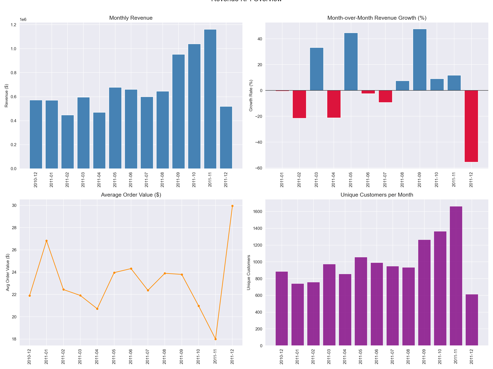
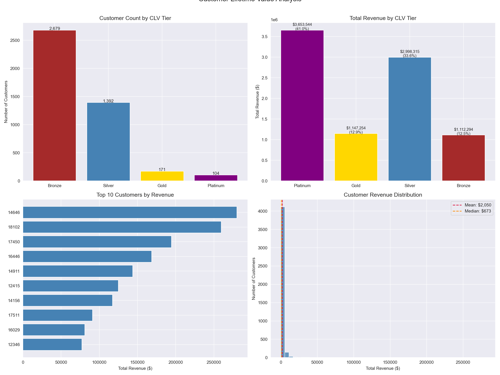
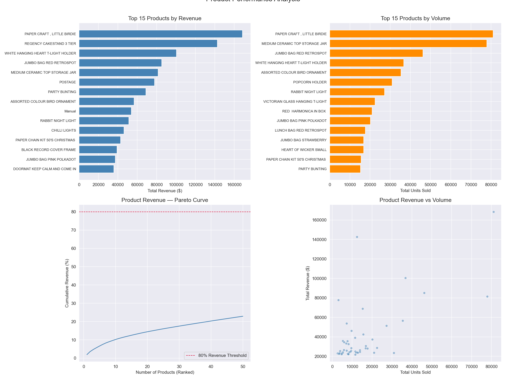
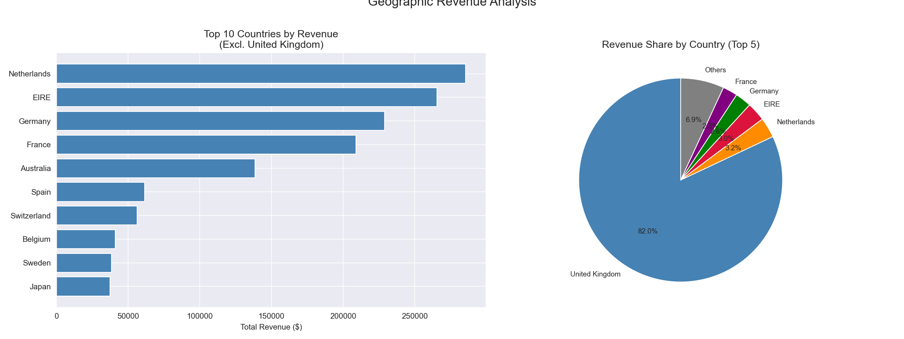
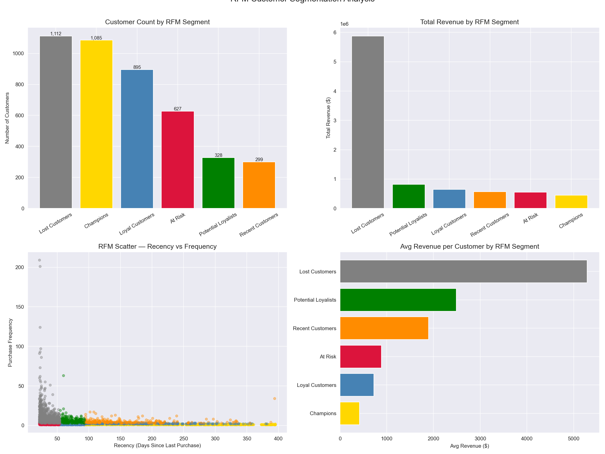
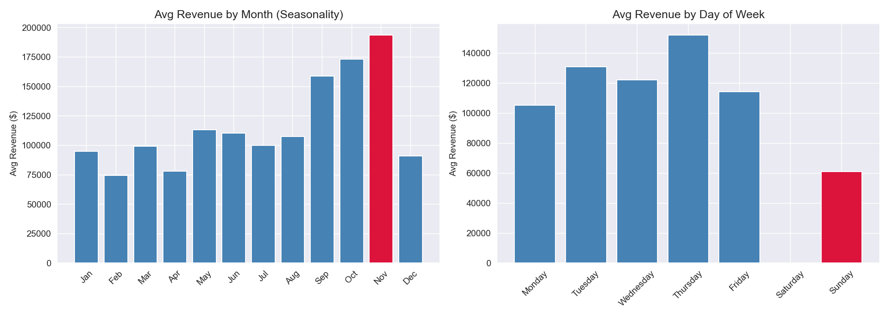

# Financial KPI Dashboard — Revenue, Customer Lifetime Value & Product Performance

A SQL and Python analysis of a U.K.-based e-commerce retailer's transaction data, building a comprehensive financial KPI framework covering revenue growth, customer lifetime value segmentation, product performance, geographic analysis, and RFM customer segmentation using PostgreSQL and Python.

---

## Problem Statement
Understanding business financial performance requires more than tracking total revenue — it demands a clear view of growth trends, customer value distribution, product contribution, and customer behavior patterns. This project analyzes 397,884 transactions across 4,338 customers to answer:
- What are the revenue trends and month-over-month growth rates?
- Which customers generate the most lifetime value?
- Which products drive the most revenue and volume?
- How can customers be segmented using RFM analysis?

---

## Dataset
- **Source:** [Kaggle — E-Commerce Data](https://www.kaggle.com/datasets/carrie1/ecommerce-data)
- **Size:** 397,884 transactions (after cleaning), 4,338 unique customers, 3,665 unique products
- **Period:** December 2010 – December 2011
- **Total Revenue:** $8,911,407.90
- **Database:** PostgreSQL (local)

---

## Tools & Libraries
- PostgreSQL, pgAdmin
- Python 3.x
- Pandas, NumPy
- Matplotlib, Seaborn
- SQLAlchemy, psycopg2

---

## Project Workflow
1. Data ingestion — loaded CSV into PostgreSQL via Python, removed cancelled orders, missing customer IDs, negative quantities and prices, engineered revenue, time, and date features
2. SQL analysis — monthly revenue with MoM growth, customer lifetime value scoring, product performance with Pareto curve, RFM segmentation using Window Functions
3. Python visualization — revenue KPIs, CLV tier analysis, product performance, geographic revenue, RFM segmentation, seasonal and day-of-week patterns
4. Business insight communication — translated all technical findings into executive-level business recommendations

---

## SQL Techniques Demonstrated
- Common Table Expressions (CTEs)
- Window Functions (LAG for MoM growth, RANK, NTILE for RFM scoring, cumulative SUM OVER)
- PARTITION BY for revenue share calculations
- Multi-condition CASE WHEN for CLV and RFM tier classification
- NULLIF for safe division
- DATE arithmetic for recency and lifespan calculations

---

## Key Findings
- Business generated **$8,911,407.90 total revenue** across 397,884 transactions with a consistent **3.62% average month-over-month growth rate** across the 13-month analysis period
- **104 Platinum customers (2.4% of base) drove 41% of total revenue** at $35,130 average spend — the single highest-priority retention cohort; top customer alone spent $280,206.02
- **Top 10 customers represent 17.26% of total revenue** and top 100 account for 40.54% — extreme concentration requiring dedicated account management strategy
- **RFM analysis revealed a B2B distortion** — Lost Customers generated 65.9% of total revenue ($5,876,156) at $5,284 avg spend, exposing that standard RFM scoring conflates infrequent wholesale buyers with genuinely churned retail customers
- **"PAPER CRAFT, LITTLE BIRDIE" top revenue product ($168,469.60) had only 1 unique customer** — a single wholesale order masquerading as retail demand; "REGENCY CAKESTAND 3 TIER" ($142,592.95 across 881 customers) is the true top retail product
- **United Kingdom accounts for 82.0% of revenue** — extreme home market concentration; Netherlands and EIRE show highest revenue-per-customer ratios suggesting strong wholesale relationships worth developing internationally
- **Saturday shows zero revenue** — confirming B2B wholesale business model where orders are placed on business days; Thursday is the strongest trading day at $152,066 average
- **November is the peak revenue month** at $193,636 average — classic holiday gift retail seasonality with Q4 driving the business's strongest trading period

---

## Visualizations

### Revenue KPI Overview

### Customer Lifetime Value Analysis

### Product Performance

### Geographic Revenue Analysis

### RFM Customer Segmentation

### Seasonal & Day-of-Week Analysis

---

## SQL Query Files
All queries are saved in the `sql/` folder:
- `01_create_table.sql` — schema creation
- `02_revenue_analysis.sql` — monthly revenue with MoM growth using LAG Window Function
- `03_customer_lifetime_value.sql` — CLV scoring, tier classification, revenue ranking
- `04_product_performance.sql` — product revenue and volume ranking with Pareto cumulative curve
- `05_window_functions.sql` — RFM segmentation using NTILE scoring and CASE classification

---

## Limitations & Next Steps
- Revenue calculated as quantity × unit price — does not account for returns, discounts, or cost of goods sold
- RFM model conflates B2B wholesale buyers with B2C retail customers — a production model would segment customer types before scoring
- Dataset covers only 13 months — insufficient for multi-year cohort or long-term CLV analysis
- Future work: B2B/B2C customer separation, cohort analysis, gross margin integration, Power BI executive dashboard, predictive CLV using BG/NBD model

---

## How to Run This Project
1. Clone the repository
2. Install PostgreSQL and pgAdmin from [postgresql.org](https://postgresql.org)
3. Create a database called `financial_kpi` in pgAdmin
4. Download `data.csv` from [Kaggle](https://www.kaggle.com/datasets/carrie1/ecommerce-data) and place it in the project root folder
5. Install Python dependencies: `pip install pandas numpy matplotlib seaborn sqlalchemy psycopg2-binary`
6. Open `financial_kpi.ipynb` in Jupyter or VS Code
7. Update the database connection string with your PostgreSQL password
8. Run all cells — data loads automatically into PostgreSQL and all analysis runs end to end

---

## Repository Structure

---

## Author
**Mihrimah Qozat**
[LinkedIn](https://linkedin.com/in/mihrimah-qozat) |
[GitHub](https://github.com/mihrimahqozat)
